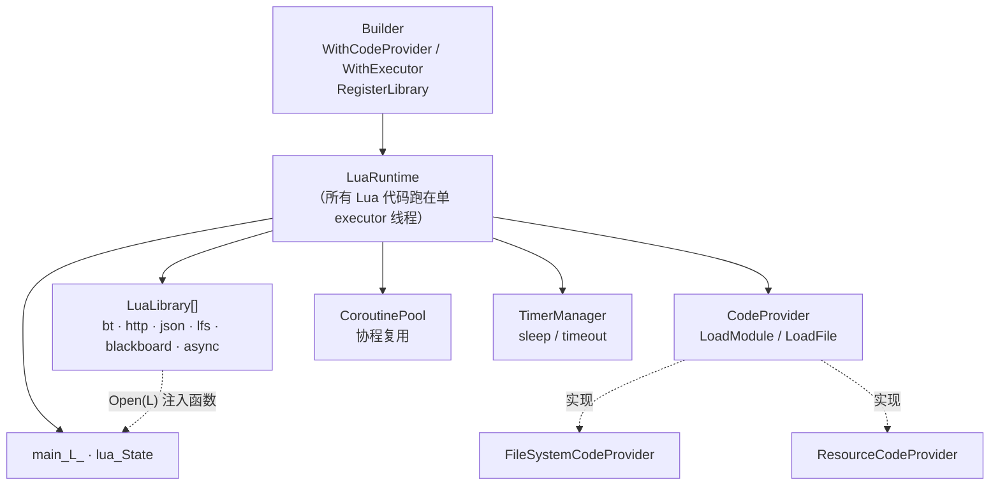
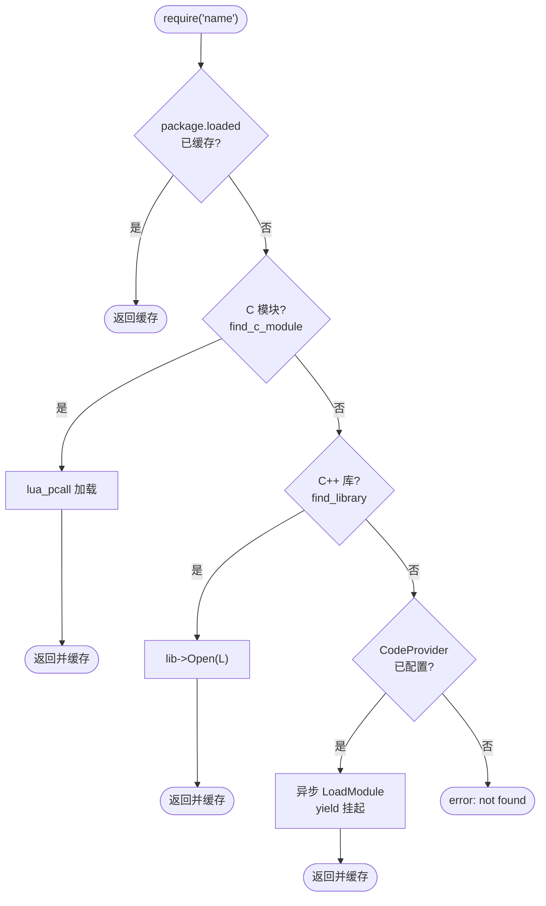

# Lua 运行时核心架构

基于 Lua 5.4 + async_simple 的异步 Lua 运行时。所有 Lua 代码在**单一 executor 线程**上运行（无锁），通过协程的 **yield / resume** 实现非阻塞：脚本发起异步操作时挂起，操作完成后回到同一线程恢复。

## 1. 核心组件

`LuaRuntime` 是核心，由 `Builder` 注入依赖，持有 Lua 状态、执行器、脚本来源、注册库、协程池与定时器。



- **CodeProvider**：脚本来源抽象。`LoadModule` 供 `require`，`LoadFile` 供 `loadfile`。文件系统与资源两种实现。
- **LuaLibrary**：C++ 库（如 `bt`、`http`）通过 `Open(L)` 向 Lua 注入模块表，是 `require` 的一等解析来源。
- **CoroutinePool / TimerManager**：复用协程 `lua_State`，支撑 `sleep`/`timeout`。

## 2. require 模块解析优先级

`require("name")`（`custom_require`）按以下顺序解析，命中即缓存到 `package.loaded`：



## 3. 异步加载时序（require / loadfile）

`require`/`loadfile` 的核心特色：缓存与同步来源未命中时，协程 **yield 挂起**，异步读取脚本，完成后回到**同一线程**编译并恢复。

```mermaid
sequenceDiagram
    participant S as Lua 脚本协程
    participant RT as LuaRuntime<br/>(executor 线程)
    participant CP as CodeProvider

    S->>RT: require("foo.bar")
    Note over RT: 缓存 / C 模块 / C++ 库 均未命中
    RT->>RT: PreYield(L) 取 AsyncHandle<br/>lua_yieldk 挂起协程
    RT->>CP: LoadModule("foo.bar")<br/>协程 .via(executor).detach()
    Note over CP: 异步读取文件/资源
    CP-->>RT: optional&lt;source&gt;
    alt 找到
        RT->>RT: PushRequireRun(handle, source, name)<br/>luaL_loadbuffer + lua_resume
        RT-->>S: 恢复协程，返回模块
    else 未找到
        RT-->>S: PushResume(nil) → error
    end
```

`loadfile` 走同一套机制（`ResumeFileLoad` / `PushLoadFileRun` / `ProcessLoadFileRun`）。

## 4. 调度模型要点

- **单线程串行**：Lua 代码、`require` 编译、库调用都在同一个 executor 线程，无需加锁。
- **yield/resume 非阻塞**：任何异步等待（`CodeProvider` 加载、`sleep`、HTTP、BT 脚本）都通过 `PreYield` 挂起协程、完成后 `PushResume`/`PushRequireRun` 恢复，不阻塞线程。
- **generation 防陈旧**：BT 引擎等异步操作用 generation 计数检测 `Stop()` 后的过期恢复。
